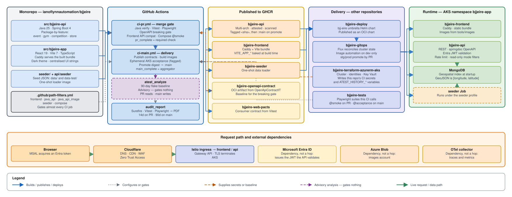

# BJJ Eire

<p align="center">
  
</p>

> A community directory of Brazilian Jiu-Jitsu events and gyms across Ireland.

[](https://github.com/ianoflynnautomation/bjjeire/actions/workflows/release.yml)
[](LICENSE)
[](https://openjdk.org/projects/jdk/25/)
[](https://spring.io/projects/spring-boot)
[](https://react.dev)
[](https://www.typescriptlang.org)

## Overview

BJJ Eire is a full-stack application with a React SPA served by Caddy, a Java 25 Spring Boot REST API, and MongoDB persistence.



## Documentation

| | |
|---|---|
| **[Architecture](docs/architecture.md)** | Runtime topology, package-by-feature API, frontend structure, contracts, repository boundaries |
| **[CI/CD](docs/ci-cd.md)** | CI PR and CI main pipelines — job graphs, path filters, gating, promotion |
| **[Decisions (ADRs)](docs/adr/)** | Why the API is package-by-feature, why contracts ship as OCI artifacts, why flake analysis gates nothing |
| **[All docs](docs/)** | Full index |
| **[AGENTS.md](AGENTS.md)** | Conventions and guardrails — for coding agents and new contributors alike |

## Tech Stack

| Layer | Technology |
|---|---|
| Frontend | React 19, Vite 7, TypeScript, Tailwind CSS 4, TanStack Query v5, React Router 7 |
| Web Server | Caddy |
| Backend | Java 25, Spring Boot 4, Spring Web, Spring Data MongoDB, Spring Security |
| Auth | Microsoft Entra ID, MSAL Browser |
| Database | MongoDB |
| Infrastructure | Docker, GHCR, AKS, Flux v2, Istio, Helm |
| Observability | OpenTelemetry, Prometheus, Grafana, Jaeger, Loki |

## Getting Started

### Prerequisites

- Docker Desktop or Docker with Compose v2
- Java 25
- Maven 3.9+
- Node.js for frontend development
- A `.env` file
- A `secrets/` directory containing `mongodb_password.txt`
- A Microsoft Entra ID app registration for API and SPA authentication

### Run with Docker Compose

```bash
docker compose --profile app -f docker-compose.yml -f docker-compose.override.local.yml up --build --wait
```

```bash
docker compose --profile app -f docker-compose.yml -f docker-compose.override.local.yml down
```

### Pull Images from GHCR

```bash
docker login ghcr.io
GHCR_OWNER=ianoflynnautomation docker compose --profile app -f docker-compose.yml -f docker-compose.override.ghcr.yml up --pull always --wait
```

## Configuration

Use `.env` for local configuration:

```env
SPRING_PROFILES_ACTIVE=local
SERVER_PORT=8080
MONGODB_USER=admin
MONGODB_PASSWORD=your-password
MONGODB_DB=Mongodb
ENTRA_ISSUER_URI=https://login.microsoftonline.com/your-tenant-id/v2.0
ENTRA_AUDIENCE=api://your-api-client-id
VITE_APP_MSAL_CLIENT_ID=your-spa-client-id
VITE_APP_MSAL_AUTHORITY=https://login.microsoftonline.com/your-tenant-id
VITE_APP_MSAL_API_SCOPE=api://your-api-client-id/Events.ReadWrite
VITE_APP_CF_BEACON_TOKEN=your-cf-beacon-token
GHCR_OWNER=your-github-username-or-org
API_IMAGE_TAG=latest
FRONTEND_IMAGE_TAG=latest
```

`VITE_APP_*` variables are injected as Docker build arguments and embedded into the frontend bundle at image build time.

## Local Development

Run the backend:

```bash
mvn -pl src/bjjeire-api spring-boot:run
```

Run the frontend:

```bash
cd src/bjjeire-app
npm install
npm run dev
```

## Testing

Backend:

```bash
mvn clean verify
```

Frontend:

```bash
bash build-react.sh
```

## CI/CD

GitHub Actions build, test, release, and publish Docker images and contracts to
GHCR. **Full detail — job graphs, gating rules, and failure modes — is in
[docs/ci-cd.md](docs/ci-cd.md).**

| Workflow | File | Purpose |
|---|---|---|
| **CI PR** | `.github/workflows/ci-pr.yml` | Merge gate: build, test, contract checks, Compose `@smoke`. `pr_complete` is the required check |
| **CI Main** | `.github/workflows/ci-main.yml` | Publish contracts, build images, ephemeral acceptance, promote digests to `:main` |
| Build & Push | `.github/workflows/build-push-ghcr.yml` | Multi-arch image build, scan, attest, push |
| PR Env Validation | `.github/workflows/pr-env-validation.yml` | Flux preview on AKS + Playwright acceptance |
| Release | `.github/workflows/release.yml` | Versioned releases via release-please |
| Audit Release Report | `.github/workflows/audit-release.yml` | Compliance pack (release ID, SHA-256 catalog, PDF + Step Summary) |

Debugging a red acceptance job: [docs/acceptance-ci-debug.md](docs/acceptance-ci-debug.md).
Audit-ready release PDF: [docs/release-test-report.md](docs/release-test-report.md).

## Versioning

- API tags use `api-v*`.
- Frontend tags use `frontend-v*`.
- Conventional Commits drive release-please.

## License

MIT. See [LICENSE](LICENSE) for details.
