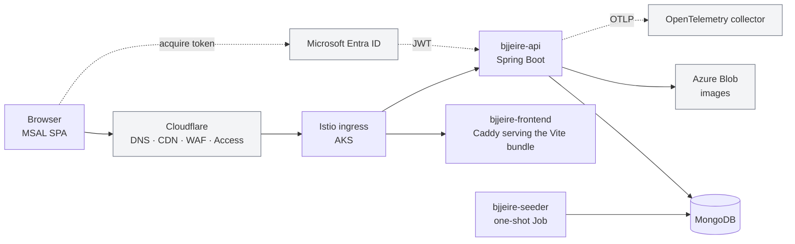
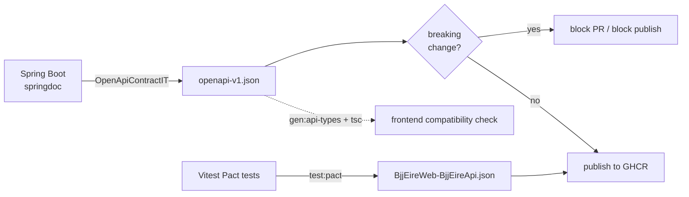

# Architecture

A community directory of Brazilian Jiu-Jitsu events, gyms, competitions, and
stores across Ireland. React SPA served by Caddy, Java Spring Boot REST API,
MongoDB persistence, deployed to AKS by Flux from a separate GitOps repo.

## Runtime topology



The SPA and API are separate images behind the same ingress. The browser
authenticates against Entra with MSAL and attaches the resulting JWT; the API
validates it against the `bjjeire-api-<env>` audience. Nothing in this
repository provisions the cluster or the edge — see
[repository boundaries](#repository-boundaries).

A detailed, editable version is
[`diagrams/architecture.drawio.svg`](diagrams/architecture.drawio.svg).

## Repository layout

```
pom.xml                      # aggregator
src/
  bjjeire-api/               # Java 25 · Spring Boot 4
    src/main/java/com/bjjeire/api/
    src/main/resources/      # application.yml, application-seeder.yml
    Dockerfile, seeder.Dockerfile
  bjjeire-app/               # React 19 · Vite 7 · TypeScript
    src/
    Dockerfile
seeder/data                  # seed JSON for real data
seeder/data-test             # seed JSON for test environments
tools/images                 # image assets shipped in the frontend container
Caddyfile                    # frontend web server config
docker-compose*.yml          # local and CI stacks
.github/workflows/           # see ci-cd.md
```

## API — package by feature

The Java API is **package-by-feature**, not layered. One flat package per
feature holds its controller, service, DTOs, domain model, validation, mapper,
and repository together:

```
com/bjjeire/api/
  event/          competition/     gym/          store/
  common/         audit/           deactivation/
  web/            config/          seeder/
```

A feature package is self-contained. `event/` holds `BjjEventController`,
`BjjEventService`, `BjjEventRepository`, `BjjEvent`, `BjjEventDto`,
`BjjEventMapper`, `BjjEventDtoValidator`, the command/response records, and the
feature's enums (`EventStatus`, `PricingType`, `WeekDay`) — roughly 25 types
that only that feature uses.

**New backend code goes in its feature package**, never in a shared layered
package. See [ADR-0001](adr/0001-package-by-feature-api.md).

| Shared package | Holds |
|---|---|
| `common` | `County`, `Location`, `GeoCoordinates`, `PagedResponse`, `PaginationRequest`, `ApiRoutes`, `ApiCache`, `ValidObjectId` |
| `web` | `ApiExceptionHandler`, `FeatureFlagController`, `DonateController`, `OperationalEndpointController` |
| `config` | Security, Mongo, OpenAPI, rate limiting, read-only mode, request logging, security headers |
| `audit` | Audit trail |
| `deactivation` | Soft-delete / deactivation across features |
| `seeder` | Seed loading, run under the `seeder` Spring profile |

Controllers stay thin and delegate to services.

### Cross-cutting filters

`config/` registers a filter chain worth knowing about before debugging a
request: `SecurityConfig` (Entra JWT validation), `RateLimitFilter`,
`ReadOnlyModeFilter`, `SecurityHeadersFilter`, `RequestLoggingFilter`, and
`ClientIps` for resolving the caller behind Cloudflare.

`MongoIndexInitializer` creates indexes at startup — including the geospatial
index the location queries need.

### Conventions

- **GeoJSON coordinates are `[longitude, latitude]`.** This is the opposite of
  how people say it, and it is the most common data bug in this codebase.
- Paginated endpoints return `PagedResponse` with `PaginationMetadata`.
- Seeder JSON uses `"isAvailable": false`, never `null`.

## Frontend

```
src/bjjeire-app/src/
  features/       bjjevents · competitions · gyms · stores · feature-flags
  pages/          one page component per route
  components/     shared UI
  hooks/          usePaginatedQuery and friends
  services/       API clients
  contracts/      Pact consumer tests
  config/         ui-content.ts — all user-visible strings
  constants/      *DataTestIds.ts
  lib/            CVA variants
  types/          generated API types
  testing/        test utilities
```

Conventions the linters do not catch:

- Cross-folder imports use `@/`; same-folder imports stay relative.
- Components are `memo(function ComponentName())`.
- **All user-visible strings** live in `config/ui-content.ts`.
- Data test IDs come from `constants/*DataTestIds.ts` — never inline literals.
- CVA variants live in `lib/`.
- **Dark theme only.** Do not introduce light `PageLayout` backgrounds.
- Paginated lists use `usePaginatedQuery`.
- `useSearchParams` tests need `MemoryRouter` from `react-router`.

The bundle is served by Caddy in the `bjjeire-frontend` image, with images from
`tools/images` copied in and cached at the Cloudflare edge.

## Contract testing

Two contracts are generated in CI and published as OCI artifacts to GHCR:



- **OpenAPI** is produced by an integration test (`OpenApiContractIT`) against
  springdoc, so the published spec is the one the running app actually serves.
- **Pact** is the consumer contract the SPA asserts against.
- Both are pushed to `ghcr.io/<owner>/bjjeire-openapi-contract` and
  `bjjeire-web-pacts`, tagged `<sha>`, `main`, and `latest`.
- A breaking OpenAPI change blocks the PR *and* blocks publish on main.

Details: [ADR-0002](adr/0002-contracts-as-oci-artifacts.md) and
[contract-testing.md](contract-testing.md).

## Configuration

`.env` drives local runs; `secrets/mongodb_password.txt` holds the database
password. The API reads Entra settings from `ENTRA_ISSUER_URI` and
`ENTRA_AUDIENCE`.

**`VITE_APP_*` variables are Docker build arguments**, baked into the bundle at
image build time — not read at runtime. Changing one requires a rebuild, and a
stale value ships a frontend pointing at the wrong API or tenant. See
[ADR-0006](adr/0006-vite-config-is-baked-at-image-build.md).

## Repository boundaries

| Repository | Owns |
|---|---|
| **bjjeire** (this repo) | API, SPA, seeder, their images and contracts |
| [bjjeire-terraform-azurerm-aks](https://github.com/ianoflynnautomation/bjjeire-terraform-azurerm-aks) | Azure, Cloudflare, Entra, identities, Key Vault, and the CI variables this repo reads |
| [bjjeire-terraform-gitops-flux-bootstrap](https://github.com/ianoflynnautomation/bjjeire-terraform-gitops-flux-bootstrap) | Flux bootstrap |
| [bjjeire-gitops](https://github.com/ianoflynnautomation/bjjeire-gitops) | Everything in-cluster: Flux, Istio, observability, app releases |
| [bjjeire-deploy](https://github.com/ianoflynnautomation/bjjeire-deploy) | The `bjj-eire` umbrella Helm chart |
| [bjjeire-tests](https://github.com/ianoflynnautomation/bjjeire-tests) | Playwright suites this repo's CI calls |
| [bjjeire-ci-templates](https://github.com/ianoflynnautomation/bjjeire-ci-templates) | Reusable workflows and composite actions |

This repository publishes **images and contracts**. It does not deploy them —
Flux does, from `bjjeire-gitops`, using the chart from `bjjeire-deploy`.
A code change reaching production is three repositories' worth of movement.

## Where to go next

- [ci-cd.md](ci-cd.md) — CI PR and CI main pipelines in detail
- [adr/](adr/) — why the platform is shaped this way
- [contract-testing.md](contract-testing.md) — Pact and OpenAPI workflow
- [acceptance-ci-debug.md](acceptance-ci-debug.md) — debugging a red acceptance job
- [cutover-checklist.md](cutover-checklist.md) — release cutover steps
