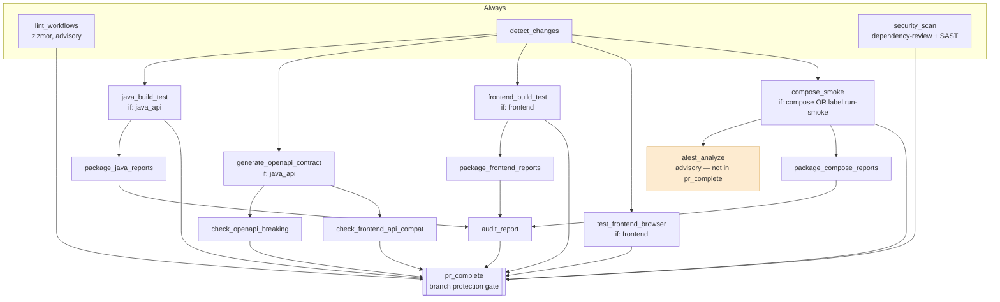
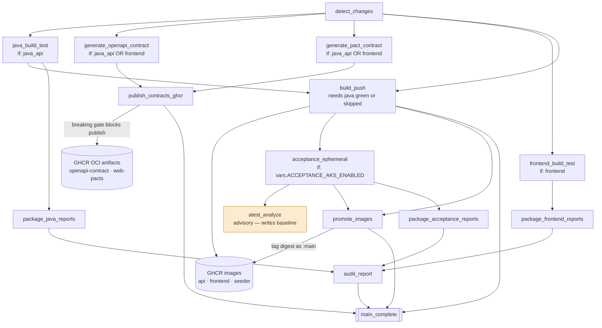

# CI/CD

Two pipelines carry the weight: **CI PR Validation** gates merges, **CI Main
Delivery** publishes contracts, builds images, and promotes them. Everything
else is periodic or on-demand.

Most jobs are thin callers of reusable workflows in
[`bjjeire-ci-templates`](https://github.com/ianoflynnautomation/bjjeire-ci-templates),
SHA-pinned to `513f5c1c…` (v1.6.2). Bump that pin in one place per workflow.

| Workflow | Trigger | Purpose |
|---|---|---|
| [`ci-pr.yml`](../.github/workflows/ci-pr.yml) | `pull_request` → `main` | Merge gate: lint, security, build, test, contracts, smoke |
| [`ci-main.yml`](../.github/workflows/ci-main.yml) | `push` → `main` | Publish contracts, build and push images, acceptance, promote |
| [`build-push-ghcr.yml`](../.github/workflows/build-push-ghcr.yml) | `workflow_call` / dispatch | Multi-arch image build, scan, attest, push |
| [`release.yml`](../.github/workflows/release.yml) | push / schedule | release-please version tags |
| [`pr-env-validation.yml`](../.github/workflows/pr-env-validation.yml) | manual / label | Flux preview env on AKS + Playwright |
| [`acceptance-staging.yml`](../.github/workflows/acceptance-staging.yml) | manual | Acceptance against staging |
| [`audit-release.yml`](../.github/workflows/audit-release.yml) | release | Compliance pack + PDF |
| [`destroy-ephemeral-env.yml`](../.github/workflows/destroy-ephemeral-env.yml) | manual / cleanup | Tear down preview namespaces |
| [`validate-data.yml`](../.github/workflows/validate-data.yml) | PR on seed data | Seeder JSON validation |
| [`issue-to-pr.yml`](../.github/workflows/issue-to-pr.yml) | issue forms | Turn gym/event/store issue forms into PRs |
| [`cleanup-artifacts.yml`](../.github/workflows/cleanup-artifacts.yml) | schedule | Artifact retention |
| [`labels.yml`](../.github/workflows/labels.yml) | push | Label sync |

---

## Change detection drives everything

Both pipelines start with `detect_changes`, which evaluates
[`.github/path-filters.yml`](../.github/path-filters.yml) and emits a JSON list
of matched filters. Almost every downstream job is `if:`-gated on
`contains(fromJSON(needs.detect_changes.outputs.changes), '<filter>')`.

| Filter | Matches | Gates |
|---|---|---|
| `frontend` | `src/bjjeire-app/**`, `Caddyfile`, `tools/images/**` | Frontend build/test, browser tests, pact, frontend image |
| `java_api` | `src/bjjeire-api/**` | Java build & test, OpenAPI contract generation |
| `java_api_image` | `src/bjjeire-api/src/main/**`, `pom.xml`, `Dockerfile` | API image build — deliberately narrower than `java_api`, so a test-only change does not rebuild the image |
| `seeder` | `seeder.Dockerfile`, `api/seeder/**`, `seeder/data/**` | Seeder image |
| `compose` | compose files, `smoke-pre-up.sh`, all three Dockerfiles, `Caddyfile` | Compose smoke tests |

**Consequences to know:**

- A docs-only change matches nothing and skips almost the whole pipeline. Both
  workflows also `paths-ignore` `**.md` and `docs/**`, so they may not run at all.
- Editing only `src/bjjeire-api/src/test/**` matches `java_api` but **not**
  `java_api_image` — tests run, no image is built. That is intended.
- `compose_smoke` can be forced on any PR with the **`run-smoke`** label, which
  is the escape hatch when a change affects runtime wiring the filters miss.

---

## CI PR Validation

Merge gate. Concurrency is per pull request with `cancel-in-progress: true`, so
a new push supersedes the running job.



### What each job does

| Job | Runs | Notes |
|---|---|---|
| `lint_workflows` | always | zizmor on workflow files. `zizmor-enforce: false` — advisory. |
| `detect_changes` | always | Path filters → JSON. |
| `security_scan` | always | Dependency review (fails on `high`) + Semgrep SAST (`p/java p/typescript p/react`). `sast-enforce: false` — SAST is advisory, dependency review is not. |
| `java_build_test` | `java_api` | `mvn verify` on Java 25, publishes a test report check. |
| `generate_openapi_contract` | `java_api` | Runs the single `OpenApiContractIT` via `maven-openapi-export` and uploads `openapi-v1-json`. Runs **in parallel** with `java_build_test` rather than reusing its output, because `maven-build-test.yml` cannot export extra artifacts. |
| `check_openapi_breaking` | after contract | Compares the generated spec against the last published contract in GHCR. **This is a merge blocker.** |
| `check_frontend_api_compat` | after contract | Downloads the spec into the frontend, regenerates API types, and runs `tsc --noEmit`. Catches an API change that would break the SPA before either side merges. |
| `frontend_build_test` | `frontend` | `tsc`, ESLint (`--max-warnings 0`), Prettier check, Vitest unit + integration with JUnit output, Pact, `vite build`. |
| `test_frontend_browser` | `frontend` | Vitest browser-mode in the Playwright container. Uploads traces/screenshots **only on failure**. |
| `compose_smoke` | `compose` or label | Brings up the full stack via Compose, seeds it, and runs `@smoke` from `bjjeire-tests` across `api` and `chromium-desktop`, 2 shards each. `fail-on-flaky: true`. |
| `atest_analyze` | after smoke | Flake scoring — see below. |
| `package_*_reports` | `always()` | Normalise Surefire/Failsafe, Vitest JUnit, and Playwright JSON into report bundles. |
| `audit_report` | `always()` | Executive PDF + step summary. `fail-on-test-failure: true`. |
| `pr_complete` | `always()` | Aggregator — the single required check. |

### `pr_complete` is the branch protection target

Rather than marking a dozen path-filtered jobs required (which would block
forever when they legitimately skip), branch protection points at
`pr_complete`. It uses `check-required-jobs` to distinguish
**intentionally skipped** from **failed**.

Adding a job to the pipeline does not gate merges until you also add it to
`pr_complete.needs`.

---

## CI Main Delivery

Runs on push to `main`. Concurrency is per ref with
**`cancel-in-progress: false`** — main runs queue rather than cancel, so a
promotion is never interrupted halfway.



### Contract publishing

`publish_contracts_ghcr` downloads both contract artifacts, structurally
validates them with `jq`, runs the **breaking-change gate again**, then pushes
each as an OCI artifact tagged `<sha>`, `main`, and `latest`:

| Artifact | Image | Artifact type |
|---|---|---|
| OpenAPI spec | `ghcr.io/<owner>/bjjeire-openapi-contract` | `application/vnd.bjjeire.openapi.v1` |
| Pact consumer contract | `ghcr.io/<owner>/bjjeire-web-pacts` | `application/vnd.pact.consumer-contract` |

The gate runs on both pipelines on purpose: the PR check gives fast feedback,
and the main check is the one that actually prevents a breaking spec from
becoming the new baseline that every future PR compares against.

### Images are promoted by digest, never rebuilt

`build_push` produces digests as job outputs. `promote_images` does **not**
rebuild — it retags the exact digest that passed acceptance:

```bash
docker buildx imagetools create --tag "${ref}:main" "${ref}@${digest}"
```

An empty or `null` digest means that image was not built this run, and
promotion skips it with a notice rather than failing. So a frontend-only change
promotes only the frontend and leaves `bjjeire-api:main` pointing where it was.

`build_push` gates on `java_build_test` being `success` **or** `skipped`, so a
seeder- or frontend-only change still builds while a red `mvn verify` never
ships.

### Ephemeral acceptance is feature-flagged

`acceptance_ephemeral` only runs when the repo variable
`ACCEPTANCE_AKS_ENABLED` is `'true'`. It provisions a Flux preview environment
on AKS keyed `sha-<run_id>` with a 4h TTL, then runs `@acceptance` from
`bjjeire-tests` across seven Playwright projects on the self-hosted
`gha-runner-scale-set`.

`keep-on-failure: true` leaves the namespace up for inspection — clean up with
`destroy-ephemeral-env.yml`.

**While the flag is off**, `acceptance_ephemeral` skips, and because
`promote_images` accepts `skipped`, images promote to `:main` with no
acceptance coverage. That is the current state and it is worth knowing.

---

## Flake analysis is advisory by design

`atest_analyze` appears in both pipelines and is **deliberately absent from
both aggregators** (`pr_complete`, `main_complete`).

The reasoning is recorded in the workflow comments: two runs went red with
*zero* failed tests — six tests passed on retry, `fail-on-flaky` fired, and on
main that also skipped `promote_images`, so images were built, scanned, and
never promoted. A binary flaky gate cannot tell one bad night from a test that
has flipped weekly for a month. `atest_analyze` scores each `(test, project)`
pair against a 90-day window so a human can.

Because it gates nothing, a broken analyzer must not block merges — hence its
exclusion from the aggregators. It still shows red in the checks list.

**The read/write split matters:**

| Pipeline | Role | Identity |
|---|---|---|
| `ci-pr.yml` | **Read** — scores the branch against trunk's baseline, `?readonly=1` | Storage Blob Data **Reader** |
| `ci-main.yml` | **Write** — the baseline describes trunk | Storage Blob Data **Contributor** |

A pull request that introduces an unstable test must not enter the baseline
before anyone decides to merge it. Both use `history-prefix: bjjeire-java` so
they read and write the same keys.

It is pinned to `ianoflynnautomation/aplaytest` at a commit SHA, not `@main` —
the repo was renamed `atest` → `aplaytest`, and Actions `uses:` does not follow
redirects.

---

## Audit reporting

Both pipelines end with the same four-stage chain:

```
package_java_reports ─┐
package_frontend_reports ─┼─► audit_report ─► PDF + Step Summary artifact
package_{compose,acceptance}_reports ─┘
```

Each `package_*` job normalises one test source into report bundles with
`category|source|glob` mappings. `audit_report` requires categories
`unit,integration,acceptance,system`, with `strict-missing: false` so a
path-skipped category does not fail the report, and `fail-on-test-failure: true`
so real failures do.

PR reports keep 14 days; main reports keep 90.

---

## Secrets and variables

**Repository variables**

| Variable | Used by |
|---|---|
| `ACCEPTANCE_AKS_ENABLED` | Feature-flags `acceptance_ephemeral` |
| `AKS_RESOURCE_GROUP`, `AKS_CLUSTER_NAME`, `AKS_CLUSTER_DOMAIN`, `AKS_ROOT_DOMAIN` | Ephemeral acceptance target |
| `ATEST_HISTORY_ACCOUNT` | Flake history storage account |
| `ATEST_VERSION` | Pins the aplaytest image tag; falls back to `main` |

These are written by the Terraform stack, not set by hand — see
`bjjeire-terraform-azurerm-aks`.

**Secrets**

| Group | Secrets |
|---|---|
| Azure OIDC | `AZURE_TENANT_ID`, `AZURE_CLIENT_ID`, `AZURE_SUBSCRIPTION_ID`, `ATEST_HISTORY_CLIENT_ID` |
| Test auth | `AZURE_TESTS_CLIENT_ID`, `AZURE_TESTS_CLIENT_SECRET`, `AZURE_API_SCOPE`, `AZURE_AUTHORITY` |
| Cloudflare Access | `CF_ACCESS_CLIENT_ID`, `CF_ACCESS_CLIENT_SECRET` |
| Playwright user | `PW_TEST_USER`, `PW_TEST_PASSWORD` |
| Ephemeral data | `EPHEMERAL_MONGO_URL`, `EPHEMERAL_MONGO_DB` |
| Frontend build args | `VITE_APP_MSAL_*`, `VITE_APP_CF_BEACON_TOKEN`, `VITE_APP_URL`, `VITE_APP_CONTACT_EMAIL`, `VITE_APP_SOCIAL_*`, `VITE_APP_GITHUB_URL` |
| Telemetry | `OTEL_EXPORTER_OTLP_ENDPOINT`, `OTEL_EXPORTER_OTLP_HEADERS` |

Azure auth is OIDC — `id-token: write` on the job, no stored cloud
credentials. The `VITE_APP_*` values are **build arguments**, baked into the
image (see [ADR-0006](adr/0006-vite-config-is-baked-at-image-build.md)); a
stale value ships a frontend that talks to the wrong API.

---

## Common failures

| Symptom | Cause |
|---|---|
| `check_openapi_breaking` red | A controller signature or DTO changed incompatibly. Either make it additive or accept the break deliberately. |
| `check_frontend_api_compat` red | The API changed and the generated TS types no longer typecheck. Fix the SPA in the same PR. |
| A job you expected did not run | Path filters. Check `detect_changes` output; add the `run-smoke` label to force compose. |
| Everything skipped | `paths-ignore` matched — docs/markdown-only change. |
| `pr_complete` red, all jobs green | A job failed *and* was in `needs`; or `audit_report` failed on `fail-on-test-failure`. |
| Images built but `:main` unmoved | `promote_images` skipped — usually `acceptance_ephemeral` failed, or `fail-on-flaky` fired. |
| `atest_analyze` red | Advisory only. It never blocks a merge. |
| 403 writing flake history from a PR | Working as designed — PRs hold Reader. |

Deeper acceptance debugging: [acceptance-ci-debug.md](acceptance-ci-debug.md).
